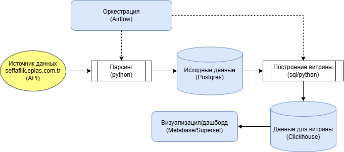

#### Курс OTUS Data Engineer
## Курсовой проект
# Сбор и анализ данных по газу с EPIAS Transparency Platform 

### Цель проекта
Реализация регулярного ELT-процесса сбора данных с сайта **EPIAS Transparency Platform** (https://seffaflik.epias.com.tr/home
) для последующего анализа и визуализации.

### Описание реализации
Сбор данных осуществляется по обращению к API платформы из python.
Полученные исходные данные сохраняются в **Postgres**. 
Затем на основе этих данных строится витрина в **Clickhouse**.
И на основе нее производится визуализация в **Metabase/Superset**.
Управляет запуском задач **Airflow**

### Схема взаимодействия сервисов и компонентов 

### Описание исходных данных
<mark>ПРЕДВАРИТЕЛЬНО будет несколько таблиц</mark> 
1. Данные по закачке/отборам из турецких ПХГ (https://seffaflik.epias.com.tr/natural-gas/natural-gas-transmission/storage/daily-actualization-amount)
2. Данные по подаче газа в ГТС (https://seffaflik.epias.com.tr/natural-gas/natural-gas-transmission/actualization/entry-amount)
3. Данные по электрогенерации (https://seffaflik.epias.com.tr/electricity/electricity-generation/ex-post-generation/real-time-generation)
4. Данные по ценам на газ (https://seffaflik.epias.com.tr/natural-gas/natural-gas-markets/spot-gas-markets-sgp/price/daily-reference-price-drp)

### Описание выходных форматов 
Дашборд с небольшой аналитикой <mark>например (в зависимости от наличия исторических данных)</mark>:
1. Текущая цена и отклонение с предыдущим днем и средней за месяц
2. Подсчет нетто в ПХГ (из данных по закачке/отборам)
3. Сравнение генерации электроэнергии с отборам из ПХГ
и т.д.
